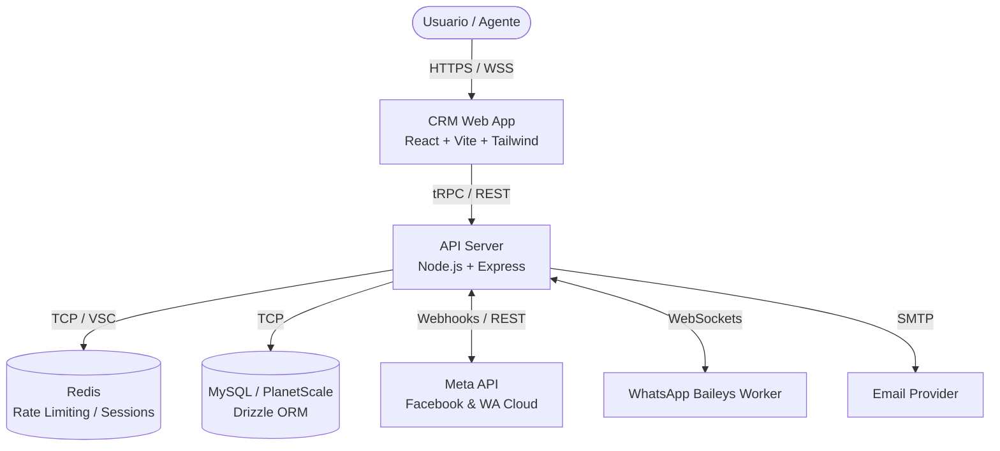

# CRM PRO V4 - Enterprise Multi-Tenant

🌟 **Sistema Avanzado de Gestión de Clientes, Ventas y Comunicaciones Multicanal**

CRM PRO V4 es una plataforma integral diseñada para equipos de ventas, soporte y marketing, con soporte robusto para múltiples tenants (aislamiento de datos), integración nativa con WhatsApp (Baileys/Meta API) y un diseño orientado a performance.

---

## 🏗 Arquitectura del Sistema (C4 Level 1 - System Context)



## 🛠 Stack Tecnológico

| Capa | Tecnologías |
|------|-------------|
| **Frontend** | React 18, Vite, TailwindCSS, trpc/react-query, Lucide React, Shadcn UI |
| **Backend** | Node.js (Express), tRPC, Drizzle ORM, Zod, Socket.io, Pino Logger |
| **Integraciones** | Baileys (WhatsApp Web), Meta API (Graph/WhatsApp Cloud) |
| **Seguridad** | express-rate-limit, Helmet, bcrypt, zod |
| **Pruebas** | Playwright (E2E), Vitest (Unit) |
| **Infra/Despliegue** | Docker, Docker Compose, Caddy (Proxy Inverso) |

---

## 🚀 Guía de Instalación Paso a Paso

### 1. Pre-requisitos
- **Node.js**: v20+ 
- **MySQL**: 8.0+
- **Redis**: 6.0+ (Opcional, pero recomendado para Rate Limiting en cluster)
- **PNPM**: Para gestión de paquetes.

### 2. Clonar el Repositorio e Instalar Dependencias
```bash
git clone <repository_url> crmpro_extract
cd crmpro_extract
npm install -g pnpm
pnpm install
```

### 3. Configurar Bases de Datos
Generar el esquema localmente y empujar hacia la base de datos MySQL configurada en `.env`:
```bash
cp .env.example .env
npm run db:push
npm run db:generate
```

### 4. Lanzar Entorno de Desarrollo
```bash
npm run dev
```

---

## 🔐 Variables de Entorno (Requeridas)

La aplicación requiere la configuración explícita de variables de entorno para operaciones criptográficas y conexiones:

- `DATABASE_URL`: URI de conexión a MySQL.
- `SESSION_SECRET`: Cadena aleatoria segura para firmar cookies de sesión.
- `DATA_ENCRYPTION_KEY`: Clave AES-256 (32 caracteres) para encriptar tokens de Meta/WA.
- `REDIS_URL`: (Opcional) Cadena de conexión a Redis para el rate-limiting en producción.
- `VITE_API_URL`: URL base del cliente para peticiones estáticas o redirecciones OAuth.

Consultar `.env.example` para una declaración exhaustiva de banderas de configuración disponibles.

---

## 💻 Comandos Principales

| Comando | Descripción |
|---------|-------------|
| `npm run dev` | Inicia el servidor de desarrollo (tsx + vite). |
| `npm run build` | Compila frontend y backend para producción (dist/). |
| `npm run start` | Ejecuta el bundle compilado de Node (`dist/index.js`). |
| `npm run check` | Ejecuta TypeScript compiler checks sin emitir (`tsc --noEmit`). |
| `npm run test` | Ejecuta los tests unitarios con Vitest. |
| `npm run e2e` | Lanza los tests funcionales E2E con Playwright. |

---

## 🔧 Troubleshooting Básico

- **Error: `DATA_ENCRYPTION_KEY missing`**  
  Genera una clave aleatoria de 32 caracteres y colócala en `.env` bajo `DATA_ENCRYPTION_KEY`.
- **Los Webhooks de Meta no llegan**  
  Asegúrate de que `META_WEBHOOK_VERIFY_TOKEN` concuerda con lo configurado en Meta Developer Console.
- **Out of Memory al compilar**  
  Incrementar memoria de Node: `export NODE_OPTIONS=--max_old_space_size=4096`.
- **Redis no conecta**  
  La app hará fallback local memory buckets si `REDIS_URL` es nulo, pero advierte pérdida de sincronicidad entre réplicas.

---

## 📘 Registro operativo (EasyPanel)

- Historial de fixes de despliegue, configuración estable y checklist post-deploy: `docs/EASYPANEL_ESTABILIZACION.md`.
